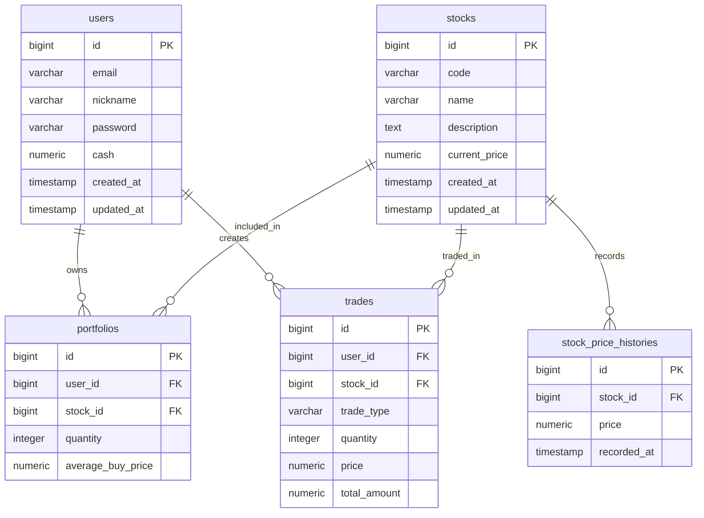

# ERD

`erd.png`는 ERD 이미지가 확정되면 추가합니다.  
초기에는 아래 Mermaid 다이어그램을 기준으로 공유합니다.

```mermaid
erDiagram
  users ||--o{ portfolios : owns
  users ||--o{ trades : creates
  stocks ||--o{ portfolios : included_in
  stocks ||--o{ trades : traded_in
  stocks ||--o{ stock_price_histories : records

  users {
    bigint id PK
    varchar email
    varchar nickname
    varchar password
    numeric cash
    timestamp created_at
    timestamp updated_at
  }

  stocks {
    bigint id PK
    varchar code
    varchar name
    text description
    numeric current_price
    timestamp created_at
    timestamp updated_at
  }

  portfolios {
    bigint id PK
    bigint user_id FK
    bigint stock_id FK
    integer quantity
    numeric average_buy_price
  }

  trades {
    bigint id PK
    bigint user_id FK
    bigint stock_id FK
    varchar trade_type
    integer quantity
    numeric price
    numeric total_amount
  }

  stock_price_histories {
    bigint id PK
    bigint stock_id FK
    numeric price
    timestamp recorded_at
  }
```
