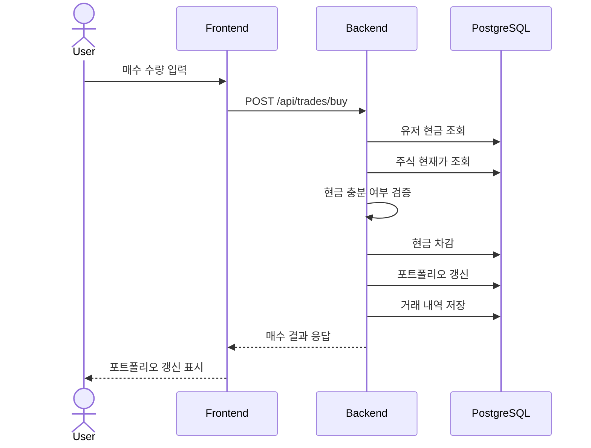
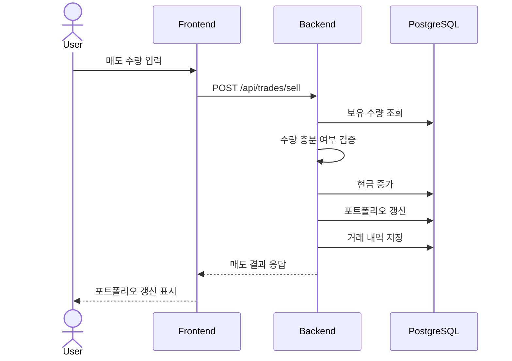

# 시퀀스 다이어그램

## 매수

```mermaid
sequenceDiagram
  actor User
  participant FE as Frontend
  participant BE as Backend
  participant DB as PostgreSQL

  User->>FE: 매수 수량 입력
  FE->>BE: POST /api/trades/buy
  BE->>DB: 유저 현금 조회
  BE->>DB: 주식 현재가 조회
  BE->>BE: 현금 충분 여부 검증
  BE->>DB: 현금 차감
  BE->>DB: 포트폴리오 갱신
  BE->>DB: 거래 내역 저장
  BE-->>FE: 매수 결과 응답
  FE-->>User: 포트폴리오 갱신 표시
```

## 매도

```mermaid
sequenceDiagram
  actor User
  participant FE as Frontend
  participant BE as Backend
  participant DB as PostgreSQL

  User->>FE: 매도 수량 입력
  FE->>BE: POST /api/trades/sell
  BE->>DB: 보유 수량 조회
  BE->>BE: 수량 충분 여부 검증
  BE->>DB: 현금 증가
  BE->>DB: 포트폴리오 갱신
  BE->>DB: 거래 내역 저장
  BE-->>FE: 매도 결과 응답
  FE-->>User: 포트폴리오 갱신 표시
```
