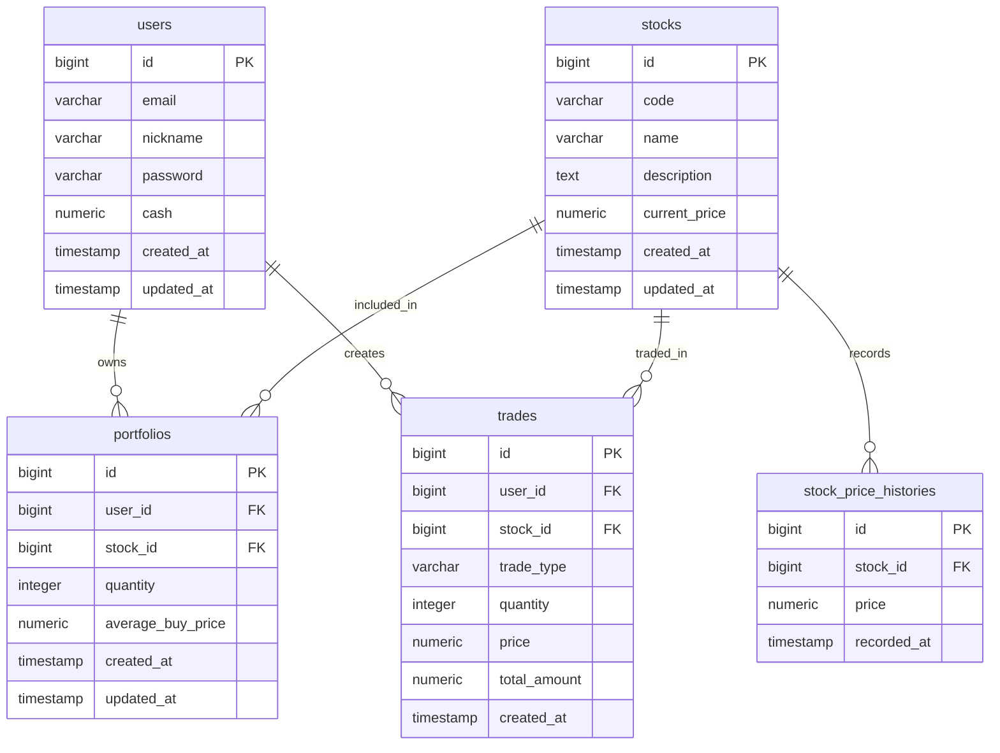

# 초기 협업 문서

## 1. 문서 목적

이 문서는 주식 시뮬레이터 MVP를 팀원들이 같은 기준으로 개발하기 위한 초기 협업 문서입니다.

초기 개발 단계에서는 화면, API, DB 구조가 자주 바뀔 수 있으므로 이 문서는 확정 설계서가 아니라 팀원 간 기준을 맞추기 위한 초안으로 사용합니다.

## 2. 프로젝트 기본 정보

### 프로젝트명

StockSim

### 프로젝트 설명

가상의 현금과 더미 주식 데이터를 사용해 주식 매수/매도, 포트폴리오 관리, 거래 내역 조회, 자산 랭킹을 경험할 수 있는 주식 시뮬레이터 웹 서비스입니다.

### 기술 스택

| 영역 | 기술 |
| --- | --- |
| Frontend | React, TypeScript, Vite |
| Backend | Java 21, Spring Boot |
| Database | MySQL |
| API | REST API |
| Auth | JWT |

### MVP 핵심 기능

- 회원가입
- 로그인
- 주식 목록 조회
- 주식 상세 조회
- 매수
- 매도
- 포트폴리오 조회
- 거래 내역 조회
- 자산 랭킹 조회

### MVP 제외 기능

- 실제 주식 API 연동
- 실시간 주가 반영
- 채팅 기능
- 지정가 주문
- 소셜 로그인
- 이메일 인증
- 관리자 페이지

## 3. 공통 정책

### 초기 자산

- 신규 가입 유저에게 가상 현금 `10,000,000`원을 지급합니다.

### 주식 데이터

- 실제 주식 API를 사용하지 않습니다.
- 서버 DB에 저장된 더미 주식 데이터를 사용합니다.
- MVP 기준 주식 종목은 9개로 시작합니다.

### 거래 정책

- 매수/매도는 현재가 기준 시장가 거래만 지원합니다.
- 매수 시 보유 현금이 부족하면 실패합니다.
- 매도 시 보유 수량이 부족하면 실패합니다.
- 거래 수량은 1 이상의 정수만 허용합니다.
- 거래 성공 시 거래 내역을 반드시 저장합니다.

### 자산 계산 정책

- 주식 평가 금액 = 현재가 * 보유 수량
- 총 주식 평가 금액 = 모든 보유 종목 평가 금액 합계
- 총 자산 = 보유 현금 + 총 주식 평가 금액
- 평가 손익 = 주식 평가 금액 - 매수 원금

## 4. 페이지 스펙

### 4.1 로그인 페이지

#### URL

`/login`

#### 목적

가입한 사용자가 서비스에 로그인하는 페이지입니다.

#### 화면 요소

| 요소 | 설명 |
| --- | --- |
| 이메일 입력 | 로그인 이메일 입력 |
| 비밀번호 입력 | 비밀번호 입력 |
| 로그인 버튼 | 로그인 요청 |
| 회원가입 이동 링크 | 회원가입 페이지로 이동 |
| 에러 메시지 | 로그인 실패 사유 표시 |

#### 사용자 행동

1. 이메일과 비밀번호를 입력합니다.
2. 로그인 버튼을 클릭합니다.
3. 로그인 성공 시 메인 페이지로 이동합니다.
4. 로그인 실패 시 에러 메시지를 표시합니다.

#### 연동 API

- `POST /api/auth/login`

### 4.2 회원가입 페이지

#### URL

`/signup`

#### 목적

신규 사용자가 계정을 생성하는 페이지입니다.

#### 화면 요소

| 요소 | 설명 |
| --- | --- |
| 이메일 입력 | 가입 이메일 입력 |
| 닉네임 입력 | 서비스에서 사용할 닉네임 입력 |
| 비밀번호 입력 | 비밀번호 입력 |
| 비밀번호 확인 입력 | 비밀번호 재입력 |
| 회원가입 버튼 | 회원가입 요청 |
| 로그인 이동 링크 | 로그인 페이지로 이동 |
| 에러 메시지 | 입력값 검증 또는 중복 오류 표시 |

#### 사용자 행동

1. 이메일, 닉네임, 비밀번호를 입력합니다.
2. 비밀번호 확인값을 입력합니다.
3. 회원가입 버튼을 클릭합니다.
4. 가입 성공 시 로그인 페이지 또는 메인 페이지로 이동합니다.

#### 연동 API

- `POST /api/auth/signup`

### 4.3 메인 페이지

#### URL

`/`

#### 목적

주식 목록을 확인하고 주요 서비스 화면으로 이동하는 진입 페이지입니다.

#### 화면 요소

| 요소 | 설명 |
| --- | --- |
| 상단 내비게이션 | 메인, 포트폴리오, 거래 내역, 랭킹 이동 |
| 내 보유 현금 요약 | 현재 사용자의 보유 현금 표시 |
| 주식 목록 테이블 | 거래 가능한 주식 목록 표시 |
| 종목명 | 주식 이름 |
| 종목 코드 | 주식 코드 |
| 현재가 | 현재 거래 가격 |
| 상세 버튼 | 주식 상세 페이지 이동 |
| 매수 버튼 | 해당 종목 매수 영역 표시 또는 상세 페이지 이동 |

#### 사용자 행동

1. 주식 목록을 확인합니다.
2. 관심 있는 종목을 선택합니다.
3. 주식 상세 페이지로 이동합니다.
4. 포트폴리오, 거래 내역, 랭킹 페이지로 이동합니다.

#### 연동 API

- `GET /api/auth/me`
- `GET /api/stocks`
- `GET /api/portfolio/me`

### 4.4 주식 상세 페이지

#### URL

`/stocks/:stockId`

#### 목적

특정 주식의 상세 정보와 매수/매도 기능을 제공하는 페이지입니다.

#### 화면 요소

| 요소 | 설명 |
| --- | --- |
| 종목명 | 주식 이름 |
| 종목 코드 | 주식 코드 |
| 현재가 | 현재 거래 가격 |
| 종목 설명 | 더미 종목 설명 |
| 간단 차트 | 더미 가격 히스토리 기반 차트 |
| 매수 수량 입력 | 매수할 수량 입력 |
| 매수 예상 금액 | 현재가 * 매수 수량 |
| 매수 버튼 | 매수 요청 |
| 매도 수량 입력 | 매도할 수량 입력 |
| 보유 수량 | 현재 유저가 보유한 해당 종목 수량 |
| 매도 예상 금액 | 현재가 * 매도 수량 |
| 매도 버튼 | 매도 요청 |

#### 사용자 행동

1. 종목 상세 정보를 확인합니다.
2. 매수 또는 매도 수량을 입력합니다.
3. 예상 거래 금액을 확인합니다.
4. 매수 또는 매도 버튼을 클릭합니다.
5. 성공 시 포트폴리오와 거래 내역이 갱신됩니다.

#### 연동 API

- `GET /api/stocks/{stockId}`
- `GET /api/stocks/{stockId}/prices`
- `GET /api/portfolio/me`
- `POST /api/trades/buy`
- `POST /api/trades/sell`

### 4.5 포트폴리오 페이지

#### URL

`/portfolio`

#### 목적

사용자의 보유 현금, 보유 주식, 총 자산을 확인하는 페이지입니다.

#### 화면 요소

| 요소 | 설명 |
| --- | --- |
| 보유 현금 | 현재 남은 가상 현금 |
| 총 주식 평가 금액 | 보유 주식의 현재 평가 금액 합계 |
| 총 자산 | 보유 현금 + 총 주식 평가 금액 |
| 보유 종목 테이블 | 보유 주식 목록 |
| 종목명 | 보유 종목 이름 |
| 종목 코드 | 보유 종목 코드 |
| 보유 수량 | 현재 보유 수량 |
| 평균 매수가 | 평균 매수 가격 |
| 현재가 | 현재 주식 가격 |
| 평가 금액 | 현재가 * 보유 수량 |
| 평가 손익 | 평가 금액 - 매수 원금 |

#### 사용자 행동

1. 현재 자산 상태를 확인합니다.
2. 보유 종목별 손익을 확인합니다.
3. 특정 종목 상세 페이지로 이동합니다.

#### 연동 API

- `GET /api/portfolio/me`

### 4.6 거래 내역 페이지

#### URL

`/trades`

#### 목적

사용자의 매수/매도 기록을 확인하는 페이지입니다.

#### 화면 요소

| 요소 | 설명 |
| --- | --- |
| 거래 내역 테이블 | 거래 기록 목록 |
| 거래 유형 | BUY 또는 SELL |
| 종목명 | 거래 종목 이름 |
| 종목 코드 | 거래 종목 코드 |
| 거래 수량 | 매수/매도 수량 |
| 거래 가격 | 거래 당시 가격 |
| 총 거래 금액 | 거래 가격 * 거래 수량 |
| 거래 일시 | 거래가 발생한 시간 |

#### 사용자 행동

1. 최근 거래 내역을 확인합니다.
2. 거래 유형, 종목, 금액을 확인합니다.

#### 연동 API

- `GET /api/trades/me`

### 4.7 랭킹 페이지

#### URL

`/ranking`

#### 목적

전체 사용자 자산 순위를 확인하는 페이지입니다.

#### 화면 요소

| 요소 | 설명 |
| --- | --- |
| 랭킹 테이블 | 자산 순위 목록 |
| 순위 | 총 자산 기준 순위 |
| 닉네임 | 유저 닉네임 |
| 보유 현금 | 유저의 보유 현금 |
| 주식 평가 금액 | 유저의 주식 평가 금액 |
| 총 자산 | 보유 현금 + 주식 평가 금액 |

#### 사용자 행동

1. 상위 유저 랭킹을 확인합니다.
2. 자신의 자산 위치를 비교합니다.

#### 연동 API

- `GET /api/rankings/assets`

## 5. API 초안

### 5.1 인증 API

| Method | Endpoint | 인증 | 설명 |
| --- | --- | --- | --- |
| POST | `/api/auth/signup` | 불필요 | 회원가입 |
| POST | `/api/auth/login` | 불필요 | 로그인 |
| GET | `/api/auth/me` | 필요 | 내 정보 조회 |

### 5.2 주식 API

| Method | Endpoint | 인증 | 설명 |
| --- | --- | --- | --- |
| GET | `/api/stocks` | 필요 | 주식 목록 조회 |
| GET | `/api/stocks/{stockId}` | 필요 | 주식 상세 조회 |
| GET | `/api/stocks/{stockId}/prices` | 필요 | 주식 가격 히스토리 조회 |

### 5.3 거래 API

| Method | Endpoint | 인증 | 설명 |
| --- | --- | --- | --- |
| POST | `/api/trades/buy` | 필요 | 매수 |
| POST | `/api/trades/sell` | 필요 | 매도 |
| GET | `/api/trades/me` | 필요 | 내 거래 내역 조회 |

### 5.4 포트폴리오 API

| Method | Endpoint | 인증 | 설명 |
| --- | --- | --- | --- |
| GET | `/api/portfolio/me` | 필요 | 내 포트폴리오 조회 |

### 5.5 랭킹 API

| Method | Endpoint | 인증 | 설명 |
| --- | --- | --- | --- |
| GET | `/api/rankings/assets` | 필요 | 자산 랭킹 조회 |

## 6. API 요청/응답 예시

### 6.1 회원가입

Request

```json
{
  "email": "user@example.com",
  "nickname": "stockUser",
  "password": "password123"
}
```

Response

```json
{
  "id": 1,
  "email": "user@example.com",
  "nickname": "stockUser",
  "cash": 10000000
}
```

### 6.2 로그인

Request

```json
{
  "email": "user@example.com",
  "password": "password123"
}
```

Response

```json
{
  "accessToken": "jwt-token",
  "user": {
    "id": 1,
    "email": "user@example.com",
    "nickname": "stockUser"
  }
}
```

### 6.3 매수

Request

```json
{
  "stockId": 1,
  "quantity": 3
}
```

Response

```json
{
  "tradeId": 10,
  "type": "BUY",
  "stockId": 1,
  "stockCode": "ALP",
  "quantity": 3,
  "price": 50000,
  "totalAmount": 150000,
  "cashAfterTrade": 9850000
}
```

### 6.4 매도

Request

```json
{
  "stockId": 1,
  "quantity": 2
}
```

Response

```json
{
  "tradeId": 11,
  "type": "SELL",
  "stockId": 1,
  "stockCode": "ALP",
  "quantity": 2,
  "price": 52000,
  "totalAmount": 104000,
  "cashAfterTrade": 9954000
}
```

### 6.5 포트폴리오 조회

Response

```json
{
  "cash": 9850000,
  "stockValue": 150000,
  "totalAsset": 10000000,
  "holdings": [
    {
      "stockId": 1,
      "code": "ALP",
      "name": "Alpha Tech",
      "quantity": 3,
      "averageBuyPrice": 50000,
      "currentPrice": 50000,
      "valuation": 150000,
      "profitLoss": 0
    }
  ]
}
```

## 7. DB 테이블 초안

### 7.1 users

사용자 계정과 보유 현금을 저장합니다.

| 컬럼 | 타입 | 제약 조건 | 설명 |
| --- | --- | --- | --- |
| id | BIGSERIAL | PK | 유저 ID |
| email | VARCHAR(255) | UNIQUE, NOT NULL | 이메일 |
| nickname | VARCHAR(50) | UNIQUE, NOT NULL | 닉네임 |
| password | VARCHAR(255) | NOT NULL | 암호화된 비밀번호 |
| cash | NUMERIC(15, 2) | NOT NULL | 보유 현금 |
| created_at | TIMESTAMP | NOT NULL | 생성일 |
| updated_at | TIMESTAMP | NOT NULL | 수정일 |

### 7.2 stocks

거래 가능한 더미 주식 정보를 저장합니다.

| 컬럼 | 타입 | 제약 조건 | 설명 |
| --- | --- | --- | --- |
| id | BIGSERIAL | PK | 주식 ID |
| code | VARCHAR(20) | UNIQUE, NOT NULL | 종목 코드 |
| name | VARCHAR(100) | NOT NULL | 종목명 |
| description | TEXT |  | 종목 설명 |
| current_price | NUMERIC(15, 2) | NOT NULL | 현재가 |
| created_at | TIMESTAMP | NOT NULL | 생성일 |
| updated_at | TIMESTAMP | NOT NULL | 수정일 |

### 7.3 stock_price_histories

차트 표시를 위한 가격 히스토리를 저장합니다.

| 컬럼 | 타입 | 제약 조건 | 설명 |
| --- | --- | --- | --- |
| id | BIGSERIAL | PK | 가격 히스토리 ID |
| stock_id | BIGINT | FK, NOT NULL | 주식 ID |
| price | NUMERIC(15, 2) | NOT NULL | 기록 가격 |
| recorded_at | TIMESTAMP | NOT NULL | 기록 시간 |

### 7.4 portfolios

사용자별 보유 주식 정보를 저장합니다.

| 컬럼 | 타입 | 제약 조건 | 설명 |
| --- | --- | --- | --- |
| id | BIGSERIAL | PK | 포트폴리오 ID |
| user_id | BIGINT | FK, NOT NULL | 유저 ID |
| stock_id | BIGINT | FK, NOT NULL | 주식 ID |
| quantity | INTEGER | NOT NULL | 보유 수량 |
| average_buy_price | NUMERIC(15, 2) | NOT NULL | 평균 매수가 |
| created_at | TIMESTAMP | NOT NULL | 생성일 |
| updated_at | TIMESTAMP | NOT NULL | 수정일 |

#### 권장 제약 조건

- `(user_id, stock_id)` UNIQUE
- `quantity >= 0`

### 7.5 trades

매수/매도 거래 내역을 저장합니다.

| 컬럼 | 타입 | 제약 조건 | 설명 |
| --- | --- | --- | --- |
| id | BIGSERIAL | PK | 거래 ID |
| user_id | BIGINT | FK, NOT NULL | 유저 ID |
| stock_id | BIGINT | FK, NOT NULL | 주식 ID |
| trade_type | VARCHAR(10) | NOT NULL | BUY 또는 SELL |
| quantity | INTEGER | NOT NULL | 거래 수량 |
| price | NUMERIC(15, 2) | NOT NULL | 거래 당시 가격 |
| total_amount | NUMERIC(15, 2) | NOT NULL | 총 거래 금액 |
| created_at | TIMESTAMP | NOT NULL | 거래 시간 |

#### 권장 제약 조건

- `trade_type IN ('BUY', 'SELL')`
- `quantity > 0`
- `price > 0`
- `total_amount > 0`

## 8. 테이블 관계



## 9. 초기 더미 데이터

### 9.1 초기 주식 데이터

| 코드 | 종목명 | 현재가 | 설명 |
| --- | --- | --- | --- |
| ALP | Alpha Tech | 50000 | 안정적인 기술주 |
| BET | Beta Bio | 12000 | 변동성이 큰 바이오주 |
| CRN | Crown Energy | 30000 | 에너지 관련 종목 |
| DLT | Delta Mobility | 24000 | 모빌리티 관련 종목 |
| ECH | Echo Games | 8000 | 게임/엔터 관련 종목 |
| FRN | Front Finance | 70000 | 금융 관련 종목 |
| GLD | Gold Retail | 18000 | 리테일 관련 종목 |
| HYP | Hyper AI | 95000 | AI 성장주 |
| IVY | Ivy Foods | 15000 | 식품 관련 종목 |

### 9.2 가격 히스토리 데이터

- MVP에서는 각 종목별로 10~20개의 더미 가격 히스토리를 미리 생성합니다.
- 차트는 해당 히스토리를 조회해서 표시합니다.
- 실시간 가격 변경은 MVP 이후 기능으로 둡니다.

## 10. 프론트엔드 협업 기준

### 라우팅 기준

| 페이지 | 경로 |
| --- | --- |
| 로그인 | `/login` |
| 회원가입 | `/signup` |
| 메인 | `/` |
| 주식 상세 | `/stocks/:stockId` |
| 포트폴리오 | `/portfolio` |
| 거래 내역 | `/trades` |
| 랭킹 | `/ranking` |

### 상태 관리 초안

- 로그인 토큰은 MVP에서는 `localStorage`에 저장합니다.
- API 요청 시 `Authorization: Bearer {token}` 헤더를 사용합니다.
- 서버 응답 DTO와 프론트 타입 이름을 최대한 맞춥니다.
- API 연동 전에는 더미 데이터로 화면을 먼저 구현합니다.

### 공통 UI 기준

- 금액은 천 단위 콤마를 표시합니다.
- 상승/수익은 초록색 계열로 표시합니다.
- 하락/손실은 빨간색 계열로 표시합니다.
- 날짜는 `YYYY-MM-DD HH:mm` 형식을 기본으로 합니다.

## 11. 백엔드 협업 기준

### 패키지 구조 초안

```text
com.stocksim
  auth
  user
  stock
  trade
  portfolio
  ranking
  global
```

### 응답 형식 초안

성공 응답은 각 API 목적에 맞는 DTO를 바로 반환합니다.

에러 응답은 아래 형식을 기준으로 맞춥니다.

```json
{
  "code": "INSUFFICIENT_CASH",
  "message": "보유 현금이 부족합니다."
}
```

### 주요 에러 코드 초안

| 코드 | 설명 |
| --- | --- |
| INVALID_LOGIN | 로그인 정보가 올바르지 않음 |
| DUPLICATED_EMAIL | 이메일 중복 |
| DUPLICATED_NICKNAME | 닉네임 중복 |
| STOCK_NOT_FOUND | 주식 없음 |
| INSUFFICIENT_CASH | 보유 현금 부족 |
| INSUFFICIENT_STOCK | 보유 주식 부족 |
| INVALID_QUANTITY | 잘못된 거래 수량 |

## 12. 개발 우선순위

### 1단계

- 프로젝트 세팅
- DB 연결
- 회원가입/로그인
- JWT 인증

### 2단계

- 주식 더미 데이터 생성
- 주식 목록/상세 API
- 주식 목록/상세 화면

### 3단계

- 매수/매도 API
- 포트폴리오 갱신
- 거래 내역 저장
- 매수/매도 UI

### 4단계

- 포트폴리오 조회
- 거래 내역 조회
- 랭킹 조회
- 화면 마무리

## 13. 협업 시 결정이 필요한 항목

- 회원가입 성공 후 자동 로그인 여부
- 포트폴리오 수량이 0이 되었을 때 row 삭제 여부
- 가격 히스토리를 고정 더미로 둘지, 서버 시작 시 랜덤 생성할지
- 랭킹에서 내 순위를 별도로 표시할지
- API 에러 응답 형식을 공통 래퍼로 감쌀지
